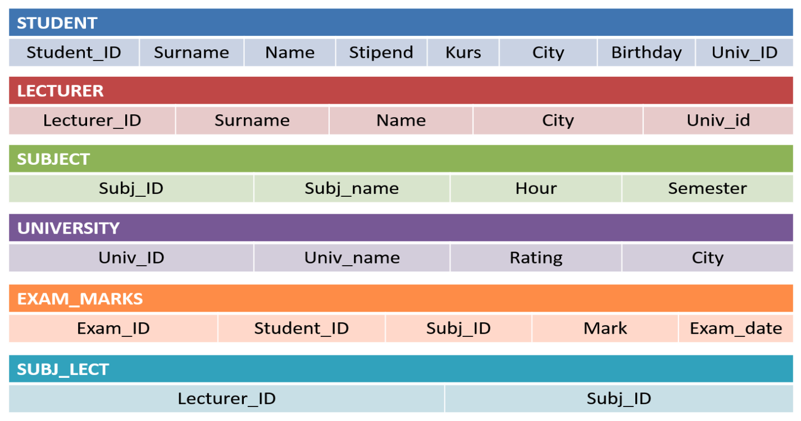

1. Напишите SQL-запрос, позволяющий вывести фамилии студентов,
обучающиеся в университетах с рейтингом не ниже 300
```sql
SELECT s.surname
FROM student s
JOIN university u
USING (univ_id)
WHERE u.rating > 300
```

2. Напишите SQL-запрос, позволяющий вывести названия университетов,
рейтинг которых превосходит рейтинг университетов города Воронежа
```sql
SELECT univ_name
FROM university
WHERE rating > (
    SELECT max(rating)
    FROM university
    WHERE city = 'Воронеж'
)
```

3. Напишите SQL-запрос, позволяющий получить идентификаторы предметов,
экзамены по которым сданы только на 4 или 5
```sql
SELECT DISTINCT subj_id
FROM exam_marks
WHERE mark = 4 OR mark = 5
```

4. Напишите SQL-запрос, позволяющий выбрать названия всех предметах
обучения, экзамены по которым сдавались 12 января 2018 года
```sql
SELECT DISTINCT subj_name
FROM subject s
JOIN exam_marks em
USING (subj_id)
WHERE em.exam_date = '12-01-2018'
```

5. Напишите SQL-запрос, позволяющий вывести названия предметов, средний
балл сдачи экзамена по которым выше 4
```sql
SELECT DISTINCT s.subj_name
FROM exam_marks em
JOIN subject s
USING (subj_id)
GROUP BY subj_id
HAVING (AVG(em.mark) > 4)
```

6. Вывести название нестоличных университетов, рейтинг которых превосходит
рейтинг любого ВУЗа из Москвы
```sql
SELECT univ_name
FROM university
where rating > (
    SELECT max(rating)
    FROM university
    WHERE city = 'Москва'
)
```

7. Вывести идентификаторы студентов, которые получили хотя бы одну
неудовлетворительную оценку за экзамен
```sql
SELECT student_id
FROM exam_marks
GROUP BY student_id
HAVING (min(mark) <= 2)
```

8. Вывести идентификаторы, фамилии и стипендии студентов, получающие
стипендию выше средней стипендии на курсе
```sql
SELECT student_id,
       surname,
       stipend
FROM student
WHERE stipend > (
    SELECT mean(stipend)
    FROM student
)
```
